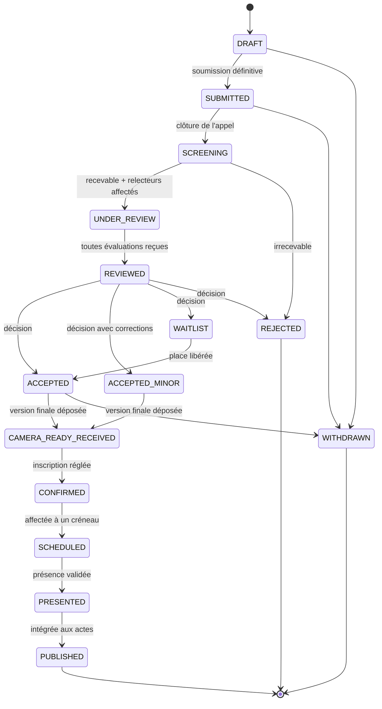
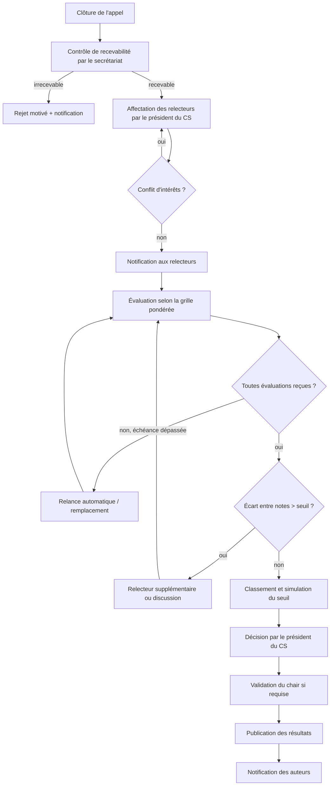
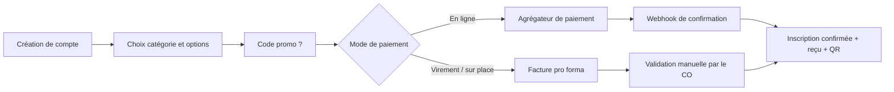
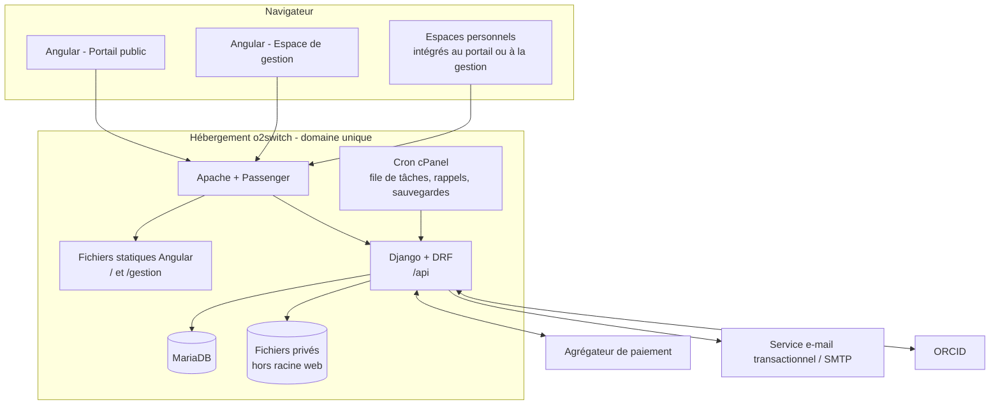
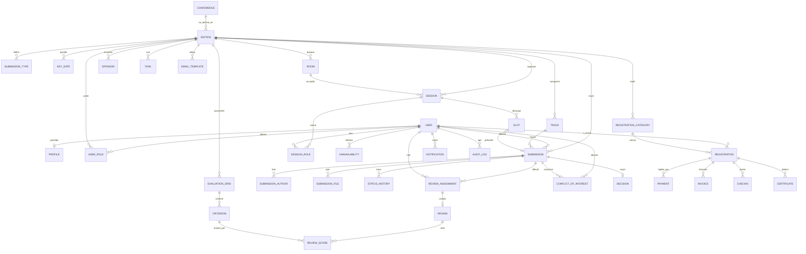
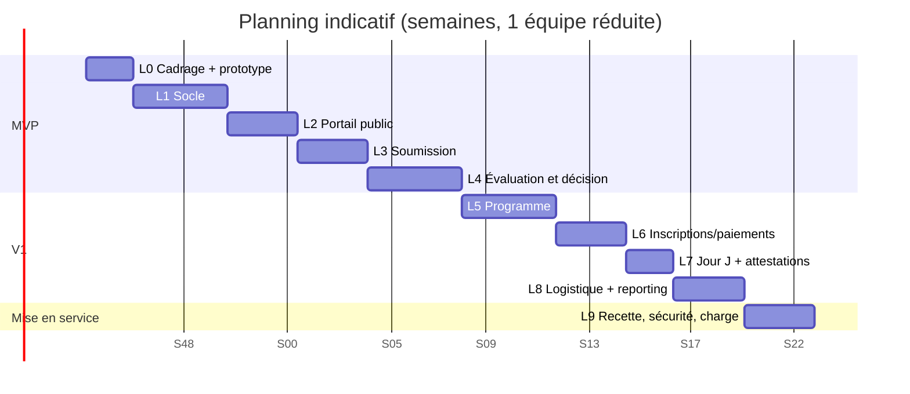

# Étude fonctionnelle et technique
## Plateforme de gestion de conférences scientifiques — « GEST-CONF »

| | |
|---|---|
| **Version** | 1.0 – document de cadrage |
| **Date** | 5 octobre 2026 |
| **Auteur** | Étude réalisée pour ZDS |
| **Statut** | Pour validation |
| **Stack imposée** | Django (sans admin) · Angular · MariaDB · o2switch (mono-domaine) |

> **Lecture rapide** : la section 1 résume les décisions clés ; les sections 4 à 6 décrivent le fonctionnel ; les sections 7 à 12 le technique et l'hébergement ; la section 13 propose des améliorations ; la section 14 le planning et les risques ; la section 15 liste les points à trancher avec le commanditaire.

---

## Table des matières

1. Synthèse et recommandations clés
2. Contexte, objectifs et périmètre
3. Acteurs, rôles et matrice des droits
4. Étude fonctionnelle par module
5. Workflows et cycles de vie
6. Règles de gestion
7. Architecture technique
8. Modèle de données (MariaDB)
9. API Django et sécurité
10. Frontends Angular
11. Hébergement o2switch et déploiement
12. Exigences non fonctionnelles
13. Propositions d'amélioration
14. Planning, charges et risques
15. Points ouverts et hypothèses
16. Annexes

---

## 1. Synthèse et recommandations clés

### 1.1 Ce que couvre la plateforme

GEST-CONF couvre le cycle complet d'une conférence scientifique : **appel à communications → candidature → évaluation pondérée par le comité scientifique → décision → programme → inscriptions → jour J → actes et bilan**. Elle comprend :

- un **portail public** (vitrine, appel à communications, programme, inscription) ;
- un **espace de gestion** (back-office) réservé aux comités et à l'administration, qui remplace l'admin Django ;
- des **espaces personnels** pour les auteurs, évaluateurs, intervenants et participants.

### 1.2 Les 10 décisions structurantes

| # | Décision | Justification |
|---|---|---|
| 1 | **Une API REST Django (DRF) unique**, documentée en OpenAPI, consommée par deux applications Angular | Séparation nette, client Angular généré, tests simples |
| 2 | **Un workspace Angular, deux applications** (`portail`, `gestion`) + une bibliothèque partagée | Le portail est public et doit être léger et référençable ; le back-office est lourd et authentifié |
| 3 | **Authentification par session + CSRF** (cookies `HttpOnly`) plutôt que JWT dans le navigateur | Mono-domaine donc pas de CORS ; pas de jeton exposé à XSS ; 2FA TOTP pour les rôles sensibles |
| 4 | **Rôles rattachés à une édition** (`UserRole(user, édition, rôle)`) | Un même utilisateur peut être relecteur en 2026 et auteur en 2027 |
| 5 | **Modèle multi-éditions dès le départ** (Conférence → Édition) | Évite une refonte si la conférence est reconduite |
| 6 | **Grilles d'évaluation configurables** (critères, poids, échelle) | Exigence centrale : critères pondérés |
| 7 | **Pas de Celery** : tâches asynchrones via file en base + cron o2switch | L'hébergement mutualisé n'offre pas de worker permanent ni de Redis |
| 8 | **Portail pré-rendu (SSG)** plutôt que SSR | Référencement sans processus Node permanent |
| 9 | **Paiement mobile money + carte** via agrégateur (CinetPay ou équivalent, à valider) | Contexte ivoirien et participants internationaux |
| 10 | **Double aveugle natif** (anonymisation des soumissions pour les relecteurs) | Standard académique ; coûteux à ajouter après coup |

### 1.3 Ce qui a été ajouté au cahier des charges initial

Au-delà de la liste fournie (portail, agenda, comités, candidatures, évaluation, statut, agenda de passage), l'étude ajoute les modules suivants, jugés indispensables pour ce type d'événement :

- **Inscriptions et paiements** (catégories tarifaires, early bird, codes promo, factures, reçus) ;
- **Gestion des conflits d'intérêts** et affectation des relecteurs (manuelle et assistée) ;
- **Version finale (camera-ready)**, **actes** et **attestations** ;
- **Check-in par QR code** et **badges** ;
- **Lettres d'invitation** (visas) ;
- **Sponsors et exposants** ;
- **Logistique** : salles, hébergement, transport, restauration, bénévoles ;
- **Tâches du comité d'organisation** (kanban) et **budget** ;
- **Communication** : modèles d'e-mails, annonces, notifications in-app ;
- **Tableaux de bord**, exports, **journal d'audit**, conformité **protection des données** ;
- **Bilinguisme FR/EN**, accessibilité, PWA pour le jour J.

Le tout est classé par priorité (MVP / V1 / V2) pour que le périmètre reste maîtrisable.

### 1.4 Points d'attention majeurs

1. **Django sans admin** : tout ce que l'admin offrait gratuitement (CRUD, filtres, exports) doit être construit dans l'espace de gestion Angular. C'est le principal poste de charge caché (voir §14).
2. **Hébergement mutualisé** : pas de WebSocket, pas de processus persistant, ressources limitées. L'architecture est pensée pour cela (§11), mais le temps réel (Q&A en direct, chat) est volontairement hors périmètre.
3. **Confidentialité de l'évaluation** : c'est le cœur de crédibilité de la plateforme. Les règles d'accès (§6, §9) sont à appliquer côté serveur, jamais seulement dans l'interface.

---

## 2. Contexte, objectifs et périmètre

### 2.1 Contexte

L'organisation d'une conférence scientifique mobilise des outils dispersés (formulaires, tableurs, e-mails). Les conséquences classiques : perte de traçabilité des évaluations, erreurs de programmation, relances manuelles, absence de vision globale pour le comité d'organisation.

### 2.2 Objectifs

| Objectif | Indicateur de réussite |
|---|---|
| Centraliser le cycle de vie d'une communication | 100 % des soumissions, évaluations et décisions tracées dans l'outil |
| Garantir une évaluation équitable et traçable | Chaque note rattachée à une grille, un relecteur, une date ; scores calculés automatiquement |
| Informer en temps réel les candidats | Statut visible à tout moment ; notification à chaque changement |
| Fiabiliser le programme | Zéro conflit de salle ou d'intervenant non détecté |
| Réduire la charge administrative | Génération automatique des factures, attestations, badges, lettres |

### 2.3 Périmètre

**Inclus** : tout ce qui est décrit au §4 (modules M1 à M17).

**Exclus de la version initiale** (voir §13 pour les évolutions) :

- diffusion vidéo en direct hébergée par la plateforme (on intègre des liens Zoom/Teams/YouTube) ;
- chat et questions-réponses en temps réel ;
- application mobile native (une PWA est prévue) ;
- comptabilité complète (on produit le suivi budgétaire et les exports).

### 2.4 Hypothèses de dimensionnement

À confirmer au §15. Base de travail retenue :

| Paramètre | Valeur de calcul |
|---|---|
| Éditions actives simultanément | 1 (modèle prêt pour plusieurs) |
| Soumissions par édition | 100 à 600 |
| Relecteurs | 30 à 100 |
| Participants | 200 à 1 500 |
| Pic de trafic portail | 50 à 200 visiteurs simultanés (ouverture des inscriptions, clôture de l'appel) |
| Langues | Français, anglais |

---

## 3. Acteurs, rôles et matrice des droits

### 3.1 Acteurs

| Acteur | Description |
|---|---|
| **Visiteur** | Navigue sur le portail sans compte |
| **Auteur / candidat** | Soumet une ou plusieurs communications ; peut être co-auteur d'autres |
| **Évaluateur** | Membre du comité scientifique chargé de relire des soumissions |
| **Président du comité scientifique** | Affecte les relecteurs, arbitre, rend les décisions |
| **Membre du comité d'organisation** | Gère la logistique ; sous-rôles possibles (finances, programme, communication, secrétariat) |
| **Président de la conférence (chair)** | Vue globale, validation des décisions majeures |
| **Intervenant invité (keynote)** | Orateur invité, hors processus de soumission |
| **Président de séance / discutant** | Anime une session du programme |
| **Participant** | Inscrit à l'événement |
| **Sponsor / exposant** | Partenaire avec espace dédié |
| **Bénévole** | Accès restreint au check-in et à l'accueil |
| **Administrateur technique** | Paramétrage global, gestion des comptes, audit |

### 3.2 Rôles applicatifs

Rôles stockés dans `UserRole` (par édition) : `ADMIN`, `CHAIR`, `OC_MEMBER` (avec `oc_function`), `SC_CHAIR`, `SC_MEMBER`, `AUTHOR`, `SPEAKER`, `SESSION_CHAIR`, `ATTENDEE`, `SPONSOR`, `VOLUNTEER`.

Un utilisateur peut cumuler plusieurs rôles. Les rôles `AUTHOR` et `ATTENDEE` sont attribués automatiquement ; les autres le sont par un administrateur ou le comité concerné.

### 3.3 Matrice des droits (extrait)

Légende : **L** lecture · **E** écriture · **V** validation/décision · **—** aucun accès · **(anon.)** accès sans identité de l'auteur

| Ressource | Auteur | Évaluateur | Prés. CS | CO | Chair | Admin |
|---|---|---|---|---|---|---|
| Sa propre soumission | L/E (avant clôture) | — | — | — | — | — |
| Toutes les soumissions | — | L (affectées, anon.) | L/E | L (méta, sans notes) | L | L |
| Identité des auteurs | — | — (double aveugle) | L | L | L | L |
| Ses évaluations | — | L/E | L | — | L | L |
| Évaluations des autres relecteurs | — | L après envoi de la sienne, si discussion ouverte | L | — | L | L |
| Décision | L (la sienne) | L (affectées) | V | L | V | L |
| Programme (brouillon) | — | — | L | L/E | L/V | L/E |
| Programme (publié) | L | L | L | L/E | L/V | L/E |
| Inscriptions et paiements | L (siennes) | — | — | L/E (finances) | L | L/E |
| Paramétrage de l'édition | — | — | — | L/E (partiel) | L/E | L/E |
| Journal d'audit | — | — | — | — | L | L |

La matrice complète (par endpoint) est à établir en phase de conception détaillée ; elle sera traduite en classes de permissions DRF et en tests automatisés (un test par case sensible).

---

## 4. Étude fonctionnelle par module

Priorités : **P1** = MVP (indispensable pour ouvrir l'appel) · **P2** = V1 (avant la conférence) · **P3** = V2 (confort, après lancement).

### M1 — Portail public (P1)

Site vitrine de l'événement, bilingue FR/EN.

| Fonction | Priorité |
|---|---|
| Page d'accueil : thème, dates, lieu, compte à rebours, appels à l'action | P1 |
| Présentation de la conférence et des thématiques (tracks) | P1 |
| **Appel à communications** : règles, formats, modèles de documents à télécharger, dates clés | P1 |
| **Dates importantes** (calendrier : soumission, notification, version finale, inscription) | P1 |
| Comité scientifique et comité d'organisation (photos, affiliations, pays) | P1 |
| **Programme public** : filtrable par jour, salle, thème, type de session ; recherche | P1 |
| Intervenants invités (biographies, résumés des keynotes) | P1 |
| Inscription et tarifs | P1 |
| Lieu, accès, hébergement, visas, informations pratiques | P2 |
| Sponsors et partenaires (logos, niveaux) | P2 |
| Actualités et annonces | P2 |
| FAQ, contact (formulaire protégé anti-spam) | P2 |
| Actes publiés et archives des éditions précédentes | P3 |
| Galerie photos / replays | P3 |

**Contrainte** : pages publiques pré-rendues, métadonnées Open Graph, plan de site, balisage schema.org `Event` pour le référencement.

### M2 — Comptes et authentification (P1)

- Inscription par e-mail avec **vérification de l'adresse**, réinitialisation du mot de passe ;
- **Connexion ORCID** (identifiant chercheur standard, apprécié des auteurs) — P2 ;
- Profil : titre, nom, prénom, institution, pays, spécialités, biographie, photo, ORCID, réseaux professionnels ;
- **Authentification à deux facteurs (TOTP)** obligatoire pour comités et administrateurs — P2 ;
- Un compte unique pour tous les rôles, sélecteur de rôle actif dans l'interface ;
- Consentements (données personnelles, publication de la photo et du résumé) horodatés ;
- Suppression / anonymisation de compte sur demande.

### M3 — Paramétrage de l'édition (P1)

Remplace la configuration par l'admin Django. Écrans réservés à `ADMIN`, `CHAIR` et au CO selon droits.

- Informations générales : nom, édition, thème, dates, lieu, fuseau horaire, langues ;
- **Thématiques / tracks** (liste, description, président de track éventuel) ;
- **Types de communication** : communication orale, poster, atelier, symposium, table ronde — avec durée par défaut, longueur de résumé, formats de fichiers acceptés ;
- **Calendrier** : ouverture/clôture de l'appel, date d'évaluation, notification, version finale, inscription anticipée, etc. ; toutes les dates pilotent des états automatiques ;
- **Grille d'évaluation** (voir M5) ;
- Tarifs et catégories d'inscription ;
- Modèles d'e-mails et de documents (attestations, lettres, factures) ;
- Contenu du portail (pages, actualités, FAQ) via un éditeur de contenu simple ;
- Paramètres de confidentialité : double aveugle activé ou non, nombre de relecteurs par soumission, seuils.

### M4 — Candidature et soumission (P1)

**Parcours auteur**

1. Création d'une soumission en **brouillon** (sauvegarde automatique) ;
2. Saisie : titre, **résumé** (limite de mots paramétrable), mots-clés, thématique, type de communication souhaité, langue ;
3. **Auteurs et co-auteurs** (ordre, affiliation, auteur correspondant, auteur présentateur) ; un co-auteur est invité par e-mail s'il n'a pas de compte ;
4. Dépôt de fichiers : résumé étendu ou article complet (PDF), fichier anonymisé si double aveugle, annexes ;
5. Déclarations : originalité, éthique, conflits d'intérêts, consentement de publication ;
6. **Soumission définitive** → accusé de réception par e-mail, numéro de référence (`GC26-0123`) ;
7. Modification possible **jusqu'à la clôture** (chaque version conservée) ; retrait possible avec motif ;
8. Après décision : dépôt de la **version finale** si acceptée, réponses aux commentaires (« rebuttal » ou lettre de réponse) si corrections demandées.

**Contrôles** : taille et type de fichier validés côté serveur, compteur de mots, détection de doublons (même titre / mêmes auteurs), vérification d'anonymisation (métadonnées PDF nettoyées).

**Priorités** : parcours complet P1 ; invitation des co-auteurs P2 ; contrôle d'anonymisation assisté P2 ; export de similarité (plagiat) P3.

### M5 — Évaluation par le comité scientifique (P1)

C'est le module central de la demande : *évaluation dans l'application avec critères pondérés*.

#### 5.1 Grille d'évaluation

La grille est **configurable par édition et par type de communication**.

| Élément | Description |
|---|---|
| **Critère** | Libellé, description d'aide à la notation, **poids** (%), échelle (ex. 0–5 ou 1–10), obligatoire ou non |
| **Poids** | La somme des poids d'une grille doit être égale à 100 (contrôle bloquant) |
| **Recommandation globale** | Accepter / Accepter avec corrections / Rejeter (+ « Discuter ») |
| **Niveau de confiance du relecteur** | 1 (peu familier) à 5 (expert) |
| **Commentaires** | Aux auteurs (visible) ; confidentiels au comité (non visible des auteurs) |
| **Éléments facultatifs** | Signalement d'éthique, de plagiat présumé, suggestion de format (oral/poster) |

**Exemple de grille par défaut (proposition)**

| Critère | Poids |
|---|---|
| Originalité et contribution scientifique | 25 % |
| Rigueur méthodologique | 30 % |
| Pertinence par rapport aux thématiques | 15 % |
| Qualité de la rédaction et de la structure | 15 % |
| Résultats, portée et impact | 15 % |

**Calcul**

```text
Note pondérée d'un relecteur  = Σ (note_i × poids_i) / Σ poids_i      (ramenée sur 100 ou sur l'échelle)
Score final de la soumission  = moyenne des notes pondérées des relecteurs
                                (option : moyenne pondérée par le niveau de confiance)
```

Exemple : échelle 0–5, notes (4 ; 3 ; 5 ; 4 ; 3) avec poids (25 ; 30 ; 15 ; 15 ; 15) :
`(4×25 + 3×30 + 5×15 + 4×15 + 3×15) / 100 = (100 + 90 + 75 + 60 + 45) / 100 = 3,70 / 5 → 74 / 100`.

#### 5.2 Affectation des relecteurs

- **Manuelle** par le président du CS ;
- **Assistée** : suggestion basée sur les mots-clés et thématiques déclarés par chaque relecteur, la **charge** (maximum paramétrable), et l'**exclusion des conflits d'intérêts** ;
- **Enchères** (« bidding ») optionnelles : les relecteurs indiquent leurs préférences sur les titres/résumés — P3 ;
- Nombre de relecteurs par soumission : paramétrable (2 ou 3 par défaut) ;
- Relecteur **de remplacement** et relance automatique si échéance dépassée.

#### 5.3 Conflits d'intérêts

Déclaration par le relecteur (même institution, co-publication récente, lien personnel) ; détection automatique du **même établissement** et des **co-auteurs connus** ; un relecteur en conflit ne voit ni la soumission ni les discussions ; tout conflit est journalisé.

#### 5.4 Double aveugle

Les relecteurs ne voient ni noms ni affiliations des auteurs ; seul le fichier anonymisé leur est servi. Les auteurs ne voient pas l'identité des relecteurs. L'anonymisation est garantie **côté serveur** (sérialiseurs distincts selon le rôle), pas seulement masquée par l'interface.

#### 5.5 Suivi, discussion et arbitrage

- Tableau de bord du président : avancement par relecteur, par track, soumissions sans relecture complète, retards ;
- **Divergence** : si l'écart entre deux notes dépasse un seuil paramétrable (ex. 30 points), alerte et proposition d'une relecture supplémentaire ;
- **Discussion confidentielle** entre relecteurs d'une même soumission, ouverte après remise de toutes les évaluations ;
- Possibilité de **modifier son évaluation** après discussion (historique conservé) ;
- Vue **classement** avec seuil d'acceptation et simulation (« combien de communications acceptées si le seuil est à X ? ») ;
- Export CSV/PDF des évaluations pour archives.

### M6 — Décision et suivi du statut de la candidature (P1)

**Décisions possibles** : `ACCEPTÉE`, `ACCEPTÉE SOUS RÉSERVE DE CORRECTIONS`, `LISTE D'ATTENTE`, `REJETÉE` ; avec **format attribué** (oral, poster, etc.) pouvant différer du format demandé.

- Décision individuelle ou **en lot** par le président du CS, après simulation ;
- Validation par le chair si la politique l'impose ;
- **Notification groupée** aux auteurs avec les commentaires (anonymisés) et le modèle d'e-mail adapté ;
- Verrou : aucune décision n'est visible des auteurs tant que le président n'a pas « publié les résultats » ;
- **Page de suivi pour l'auteur** : chronologie visuelle (frise) avec l'état courant.

**Statuts visibles par l'auteur**

| Statut interne | Libellé affiché à l'auteur |
|---|---|
| `DRAFT` | Brouillon |
| `SUBMITTED` | Soumise |
| `SCREENING` | Vérification de recevabilité |
| `UNDER_REVIEW` | En cours d'évaluation |
| `REVIEWED` | Évaluée — décision en attente *(ne montre pas les notes)* |
| `ACCEPTED` / `ACCEPTED_MINOR` / `WAITLIST` / `REJECTED` | Décision |
| `REVISION_REQUESTED` | Corrections demandées |
| `CAMERA_READY_RECEIVED` | Version finale reçue |
| `CONFIRMED` | Présentation confirmée (inscription réglée) |
| `SCHEDULED` | Programmée (date, salle, heure) |
| `PRESENTED` | Présentée |
| `PUBLISHED` | Publiée dans les actes |
| `WITHDRAWN` | Retirée |

### M7 — Programme et agenda (P1 pour le programme de base, P2 pour l'assistance)

**Structure** : Édition → Jours → Sessions → Créneaux de communication.

**Types de session** (liste paramétrable) :

- **Conférence inaugurale** / cérémonie d'ouverture ;
- **Conférences plénières (keynotes)** ;
- **Sessions parallèles** (communications orales) ;
- **Sessions posters** ;
- **Ateliers / workshops**, **tutoriels** ;
- **Tables rondes**, **panels** ;
- **Assemblée générale**, réunions de comité ;
- **Pauses café**, **déjeuners**, **cocktail**, **dîner de gala** ;
- **Visites** et activités sociales ;
- **Cérémonie de clôture** et remise de prix.

**Fonctions**

| Fonction | Priorité |
|---|---|
| Création des salles (capacité, équipements, accessibilité) | P1 |
| Création de sessions avec salle, horaires, président de séance | P1 |
| Affectation des communications acceptées aux créneaux (glisser-déposer) | P1 |
| **Détection de conflits** : salle occupée, intervenant ou président déjà engagé, chevauchement, dépassement de durée, indisponibilité déclarée | P1 |
| **Agenda de passage de chaque acteur** : fiche « Mon passage » (date, heure, salle, durée, rôle, consignes) | P1 |
| Déclaration des **indisponibilités** de l'intervenant avant planification | P2 |
| Proposition automatique de planning (regroupement par thème, contraintes) | P3 |
| **Mon programme** : le participant compose son agenda personnel | P2 |
| Export **iCal (.ics)** individuel, PDF du programme, version imprimable | P2 |
| Statut **brouillon / publié** du programme, journal des modifications | P1 |
| **Notification automatique** d'un changement (aux intervenants et aux inscrits concernés) | P2 |
| Liens de visioconférence pour sessions hybrides | P3 |

**Agenda par acteur** (exigence explicite) :

| Acteur | Ce qu'il voit |
|---|---|
| Auteur / intervenant | Ses passages : session, salle, créneau, durée, co-intervenants, consignes techniques ; bouton « Ajouter à mon agenda » |
| Président de séance | Sa ou ses sessions, la liste des intervenants avec horaires, minuterie |
| Évaluateur | Ses échéances d'évaluation, ses sessions éventuelles |
| Membre du CO | Sa grille de service (accueil, salles, logistique) |
| Participant | Son programme personnalisé |
| Bénévole | Ses postes et horaires |

### M8 — Comités (P1)

- **Comité scientifique** : liste des membres, pays, institutions, domaines d'expertise, charge maximale, disponibilité, invitation par e-mail (acceptation/refus tracés) ;
- **Comité d'organisation** : membres et **fonctions** (finances, programme, logistique, communication, relations extérieures, bénévoles) ;
- **Annuaire public** (avec consentement) ;
- Réunions : convocation, ordre du jour, comptes rendus déposés, suivi des décisions — P3.

### M9 — Inscriptions et paiements (P2)

- **Catégories** : auteur, participant, étudiant, chercheur, professionnel, accompagnant, intervenant invité, membre de comité, sponsor ;
- **Tarifs** par catégorie et période (early bird, normal, sur place), par pays (tarif local / international) ;
- Options : atelier, dîner de gala, visite, hébergement groupé ;
- **Codes promo**, gratuités, groupes ;
- **Obligation d'inscription d'au moins un auteur** pour qu'une communication acceptée soit programmée (règle paramétrable) ;
- **Paiement en ligne** : mobile money, carte via agrégateur ; **virement** et **paiement sur place** avec validation manuelle (rapprochement) ;
- **Facture / reçu PDF** numérotés, **bon de commande** institutionnel (facture pro forma) ;
- Remboursements et annulations selon règles paramétrables ;
- Exports comptables (CSV) ;
- Tableau de bord financier (recettes, impayés, prévisions).

### M10 — Intervenants invités et logistique (P2)

- Fiche intervenant : biographie, photo, titre de la keynote, besoins techniques, restrictions alimentaires ;
- **Lettres d'invitation** (visa) générées en PDF, signées numériquement (image de signature + QR de vérification) ;
- Suivi de voyage et d'hébergement (arrivée, départ, hôtel, transferts) ;
- Gestion des **salles**, du **matériel** (vidéoprojecteurs, micros, interprétation) ;
- **Restauration** : estimation des effectifs, régimes particuliers ;
- **Bénévoles** : recrutement, planning, rôles ;
- Cartographie et informations pratiques pour le public.

### M11 — Espace comité d'organisation (P1 pour les bases)

- **Tableau de bord** : soumissions, inscriptions, recettes, avancement des tâches, échéances ;
- **Tâches** : kanban (à faire / en cours / terminé), responsable, échéance, commentaires, pièces jointes — P2 ;
- **Budget prévisionnel et réalisé** par poste — P2 ;
- **Annuaire des participants** avec filtres et exports ;
- **Messagerie de masse** par segments (auteurs acceptés, relecteurs en retard, participants non payés…) ;
- **Documents partagés** (conventions, contrats, comptes rendus) ;
- **Journal d'activité** (qui a fait quoi, quand).

### M12 — Communication et notifications (P1)

- **Modèles d'e-mails** (FR/EN) avec variables (`{{nom}}`, `{{titre}}`, `{{statut}}`…) ;
- **File d'envoi** avec reprise sur erreur, journal, taux d'échec ;
- **Notifications dans l'application** (cloche) ;
- **Rappels automatiques** (échéances de soumission, d'évaluation, d'inscription) ;
- **Annonces** diffusées sur le portail et par e-mail ;
- SMS / WhatsApp — P3 (coût et dépendance à un fournisseur).

La matrice des notifications est en annexe A2.

### M13 — Sponsors et exposants (P2)

Niveaux (platine, or, argent, bronze), contreparties, logos sur le portail, espace de dépôt de documents, plan des stands, factures, badges exposants.

### M14 — Jour J (P2)

- **Badges** imprimables (PDF A6 ou planche A4) avec **QR code** unique ;
- **Check-in** par scan QR depuis un téléphone (PWA) avec liste hors-ligne synchronisable ;
- **Émargement par session** (présence réelle aux communications) ;
- **Attestations de participation / de communication / d'évaluation** générées en PDF avec **QR de vérification publique** ;
- Questionnaire de satisfaction (par session et global) ;
- Annonces de dernière minute (bandeau sur le portail et notifications).

### M15 — Actes et après-conférence (P3)

- Compilation des versions finales en **actes** (ordre, pagination, sommaire) ;
- Métadonnées de publication (DOI, ISBN/ISSN si applicable) ;
- Publication sur le portail (consentement des auteurs) ;
- Remise de **prix** (meilleure communication, meilleur poster) avec vote du comité ;
- Bilan : statistiques, satisfaction, export des données, archivage de l'édition.

### M16 — Reporting et statistiques (P2)

Taux d'acceptation par track et par pays, délais de relecture, répartition géographique, évolution des inscriptions, recettes, taux de présence. Exports CSV / XLSX / PDF.

### M17 — Administration, audit et conformité (P1)

Gestion des comptes et rôles ; **journal d'audit** (connexions, décisions, consultation de données sensibles) ; **export et suppression** des données personnelles sur demande ; **durées de conservation** paramétrables ; sauvegardes et restauration (voir §11).

---
## 5. Workflows et cycles de vie

### 5.1 Cycle de vie d'une soumission



Toute transition est portée par un **service métier unique** (`transition(submission, to_state, actor)`) qui vérifie la légalité de la transition, les droits, écrit dans l'historique, et déclenche notifications et effets secondaires. Les vues n'écrivent jamais directement le champ `status`.

### 5.2 Processus d'évaluation



### 5.3 Parcours d'inscription et de paiement



### 5.4 Construction et publication du programme

1. Le CO crée salles, jours et **sessions** (modèle de session).
2. Les communications `CONFIRMED` apparaissent dans la liste « à programmer ».
3. Le responsable programme les glisse dans les créneaux ; le **moteur de contrôle** signale les conflits en temps réel.
4. Le chair valide ; le programme passe de `DRAFT` à `PUBLISHED`.
5. Toute modification ultérieure génère une **notification ciblée** (intervenants, président de séance, inscrits ayant ajouté la session à leur agenda) et une entrée au journal.

---

## 6. Règles de gestion

| Réf. | Règle |
|---|---|
| **RG-01** | Une soumission ne peut être soumise définitivement que si tous les champs obligatoires sont renseignés, au moins un auteur est marqué « correspondant » et au moins un fichier valide est déposé. |
| **RG-02** | Après la date de clôture, toute modification d'une soumission est refusée, sauf dérogation accordée par le CO (journalisée, avec nouvelle échéance). |
| **RG-03** | Un relecteur ne peut évaluer une soumission que s'il y est affecté et qu'aucun conflit d'intérêts n'est déclaré. |
| **RG-04** | En double aveugle, aucune donnée permettant d'identifier un auteur (nom, e-mail, affiliation, métadonnées de fichier) n'est renvoyée à un relecteur par l'API. |
| **RG-05** | La somme des poids d'une grille d'évaluation vaut 100. Une grille utilisée par au moins une évaluation ne peut plus être modifiée : on la duplique en nouvelle version. |
| **RG-06** | Une évaluation est « envoyée » seulement si tous les critères obligatoires sont notés ; une fois envoyée, elle est modifiable jusqu'à la décision (chaque version historisée). |
| **RG-07** | Une soumission ne passe à `REVIEWED` que lorsque le nombre minimal de relecteurs a envoyé son évaluation. |
| **RG-08** | Un relecteur ne voit les évaluations des autres qu'après avoir envoyé la sienne et seulement si la discussion est ouverte. |
| **RG-09** | Les décisions ne sont visibles des auteurs qu'après « publication des résultats » par le président du CS. |
| **RG-10** | Un auteur ne voit jamais l'identité des relecteurs ni les commentaires confidentiels au comité. |
| **RG-11** | Une communication acceptée n'est programmable que si au moins un auteur présentateur a une inscription confirmée (règle désactivable). |
| **RG-12** | Une session ne peut contenir deux communications qui se chevauchent ; une personne ne peut être à deux endroits au même moment (orateur, président, discutant) ; une salle ne peut accueillir deux sessions simultanées. |
| **RG-13** | Le total des durées des communications d'une session ne peut dépasser sa durée, tampons de transition compris (paramétrables). |
| **RG-14** | Une facture émise n'est jamais supprimée : elle peut être annulée par un avoir. La numérotation est continue par année. |
| **RG-15** | Un paiement n'est considéré valide que sur confirmation signée de l'agrégateur (webhook vérifié), jamais sur simple retour du navigateur. |
| **RG-16** | Une attestation n'est délivrée qu'aux personnes dont la présence est enregistrée (ou, pour les auteurs, la communication marquée `PRESENTED`). |
| **RG-17** | Toute action sensible (décision, changement de rôle, export de masse, consultation de l'identité en double aveugle, modification après clôture) est inscrite au journal d'audit (qui, quoi, quand, avant/après). |
| **RG-18** | Les données personnelles d'une édition sont anonymisées ou supprimées à l'issue de la durée de conservation paramétrée. |

---

## 7. Architecture technique

### 7.1 Vue d'ensemble



### 7.2 Stack proposée

| Couche | Choix | Remarque |
|---|---|---|
| Langage backend | Python 3.12 ou 3.13 | Versions proposées par o2switch jusqu'à 3.13 (vérifié sur la FAQ o2switch) |
| Framework | **Django** (version LTS en cours) + **Django REST Framework** | `django.contrib.admin` **retiré** de `INSTALLED_APPS` et des URL |
| Documentation d'API | `drf-spectacular` (OpenAPI 3) | Génère le client TypeScript utilisé par Angular |
| Authentification | `django-allauth` (e-mail, ORCID, mode headless) + sessions + CSRF | Pas de JWT stocké dans le navigateur |
| 2FA | `django-otp` (TOTP) | Obligatoire pour comités et admins |
| Base de données | **MariaDB** (version fournie par o2switch) | Django supporte MariaDB ; jeu de caractères `utf8mb4` |
| Pilote MariaDB | `PyMySQL` (pur Python) en première intention | `mysqlclient` nécessite une compilation, accès au compilateur à demander au support o2switch (cf. FAQ) |
| Tâches asynchrones | File en base (modèle `Job`) + commande `manage.py run_jobs` lancée par **cron** | Pas de Celery/Redis sur mutualisé |
| PDF | `ReportLab` ou `fpdf2` + `pypdf`/`pikepdf` pour métadonnées | Pure Python ; **WeasyPrint** est à éviter sauf si ses bibliothèques système sont confirmées sur l'hébergement |
| QR codes | `segno` | Pure Python |
| E-mails | SMTP avec `django-anymail` vers un service transactionnel (Brevo, Mailjet, etc.) | Meilleure délivrabilité que l'envoi direct depuis le mutualisé |
| Paiement | Agrégateur : CinetPay (mobile money Afrique de l'Ouest) et/ou Stripe/PayPal pour l'international | **À valider** : disponibilité, frais, contrat |
| Frontend | **Angular** (version stable courante), composants autonomes (standalone), signaux | Une seule version pour les deux applications |
| UI | Angular Material **ou** PrimeNG | PrimeNG est riche en tableaux/planning ; Material est sobre et accessible |
| Planning (agenda) | FullCalendar (resource timeline) ou composant maison | À trancher en prototype |
| i18n | `@ngx-translate` (changement de langue sans rechargement) | Alternative : i18n natif Angular (un build par langue) |
| Tests | `pytest-django`, `factory_boy` ; Jest/Karma ; Playwright (E2E) | |
| Qualité | `ruff`, `mypy` (optionnel), ESLint, pre-commit | |
| CI/CD | GitHub Actions → build Angular + déploiement SSH/rsync | o2switch fournit l'accès SSH |

### 7.3 Organisation du code backend (Django)

```text
gestconf/
├── manage.py
├── config/
│   ├── settings/ (base.py, prod.py, dev.py)
│   ├── urls.py            # /api/... uniquement, pas d'admin
│   └── wsgi.py            # point d'entrée Passenger (passenger_wsgi.py)
├── apps/
│   ├── core/              # utilitaires, audit, paramètres, permissions de base, jobs
│   ├── accounts/          # utilisateurs, profils, rôles par édition, 2FA
│   ├── conferences/       # conférence, édition, tracks, calendrier, contenus
│   ├── committees/        # membres CS et CO, invitations, disponibilités
│   ├── submissions/       # soumissions, auteurs, fichiers, versions
│   ├── reviews/           # grilles, critères, affectations, évaluations, décisions
│   ├── program/           # salles, sessions, créneaux, indisponibilités, conflits
│   ├── registrations/     # inscriptions, tarifs, codes promo
│   ├── payments/          # paiements, factures, webhooks
│   ├── events/            # badges, check-in, attestations, lettres
│   ├── communications/    # modèles d'e-mails, envois, notifications, annonces
│   ├── sponsors/          # sponsors, exposants
│   ├── logistics/         # voyages, hébergement, bénévoles, tâches, budget
│   └── reports/           # statistiques et exports
├── tests/
└── requirements/ (base.txt, prod.txt, dev.txt)
```

**Principes** : logique métier dans des **services** (`services.py`) et non dans les vues ni les modèles ; sérialiseurs distincts par rôle pour les champs sensibles ; chaque application possède ses permissions, ses tests, ses fixtures.

**Suppression de l'admin** : retirer `django.contrib.admin` des applications installées et des URL ; conserver `auth`, `contenttypes`, `sessions`. La création du premier administrateur passe par une commande (`manage.py create_platform_admin`) ; les opérations de maintenance (import de relecteurs, réinitialisations, correction de données) passent par des **commandes de gestion** documentées, et par l'espace de gestion Angular pour tout le reste.

### 7.4 Organisation du code frontend (Angular)

```text
gestconf-web/
├── projects/
│   ├── portail/                 # application publique (SSG) + espaces personnels
│   │   └── src/app/ (accueil, appel, programme, intervenants, inscription,
│   │                 mon-espace: soumissions, evaluations, mon-programme, ...)
│   ├── gestion/                 # back-office (comités, administration)
│   │   └── src/app/ (tableau-de-bord, soumissions, evaluation, comites,
│   │                 programme, inscriptions, finances, communication,
│   │                 logistique, sponsors, parametrage, audit)
│   └── shared/                  # bibliothèque partagée
│       └── src/lib/ (api-client généré, auth, guards, interceptors,
│                     ui-kit, i18n, pipes, modèles, formulaires)
└── angular.json
```

**Où placer les espaces personnels ?** Proposition : l'**espace auteur / participant / intervenant** vit dans l'application `portail` (même expérience visuelle que le site) ; l'**espace évaluateur** vit dans `gestion` (outil de travail dense, tableaux, grilles). Le comité scientifique et le comité d'organisation partagent donc la même application `gestion`, avec une navigation filtrée par rôle. Cette répartition est à valider au §15.

**Conventions** : composants autonomes, chargement différé (lazy loading) par route, état local en signaux, formulaires réactifs typés, intercepteur d'erreurs, garde par rôle (qui ne remplace jamais le contrôle serveur), thème unique, accessibilité vérifiée par audit automatisé en CI.

---

## 8. Modèle de données (MariaDB)

### 8.1 Diagramme entité-relation (vue conceptuelle)



### 8.2 Entités principales (extrait détaillé)

Les types sont indicatifs. Toutes les tables ont `id` (BIGINT), `created_at`, `updated_at`. Moteur **InnoDB**, jeu de caractères **utf8mb4**, clés étrangères actives.

#### Identité et rôles

| Table | Champs clés |
|---|---|
| `user` | email (unique), password, is_active, email_verified_at, locale, last_login, totp_enabled |
| `profile` | user_id, civility, first_name, last_name, institution, department, country, orcid, bio, photo, expertise_keywords (JSON), consent_directory, consent_at |
| `user_role` | user_id, edition_id, role (enum), oc_function (nullable), status (invited / active / declined), invited_at, accepted_at — **unique (user, edition, role)** |

#### Conférence et paramétrage

| Table | Champs clés |
|---|---|
| `conference` | name, slug, description |
| `edition` | conference_id, year, title, theme, start_date, end_date, venue, timezone, languages, double_blind (bool), reviewers_per_submission, status |
| `track` | edition_id, name_fr, name_en, description, chair_user_id |
| `submission_type` | edition_id, code, label, default_duration_min, abstract_max_words, allowed_file_types |
| `key_date` | edition_id, code (call_open, call_close, notification, camera_ready, early_bird_end…), at, label |

#### Soumission

| Table | Champs clés |
|---|---|
| `submission` | edition_id, reference (unique), track_id, type_id, title, abstract, keywords, language, status, submitted_at, submitter_id, requested_format, assigned_format, version |
| `submission_author` | submission_id, user_id (nullable), first_name, last_name, email, institution, country, position, is_corresponding, is_presenter |
| `submission_file` | submission_id, kind (full_text, anonymous, camera_ready, annex), version, storage_path, original_name, mime, size, sha256, is_current |
| `status_history` | submission_id, from_status, to_status, actor_id, reason, at |

*Remarque* : le nom et l'e-mail des auteurs sont dupliqués dans `submission_author` pour conserver l'état au moment de la soumission, même si le profil change ensuite.

#### Évaluation

| Table | Champs clés |
|---|---|
| `evaluation_grid` | edition_id, submission_type_id (nullable), name, version, scale_min, scale_max, is_locked |
| `criterion` | grid_id, label_fr, label_en, help_text, weight (DECIMAL 5,2), position, is_required |
| `review_assignment` | submission_id, reviewer_id, assigned_by, assigned_at, due_at, status (pending / declined / submitted), reminders_sent |
| `review` | assignment_id, overall_recommendation, confidence (1–5), comment_to_authors, comment_to_committee, weighted_score (DECIMAL 5,2), submitted_at, version |
| `review_score` | review_id, criterion_id, value (DECIMAL 4,1) — **unique (review, criterion)** |
| `review_revision` | review_id, snapshot (JSON), at — historique des versions |
| `conflict_of_interest` | reviewer_id, submission_id, reason, declared_by (reviewer / system), at |
| `decision` | submission_id, outcome, assigned_format, comment, decided_by, decided_at, published_at |
| `review_discussion` | submission_id, author_id, body, at |

Le `weighted_score` est **recalculé et stocké** à l'envoi de l'évaluation (pour les classements rapides) ; la valeur de référence reste calculable à partir de `review_score` et `criterion.weight`, avec contrôle de cohérence périodique.

#### Programme

| Table | Champs clés |
|---|---|
| `room` | edition_id, name, capacity, equipment (JSON), is_accessible, location_note |
| `session` | edition_id, kind (opening, keynote, parallel, poster, workshop, round_table, break, lunch, social, closing…), title, track_id, room_id, starts_at, ends_at, status (draft / published), is_hybrid, stream_url |
| `slot` | session_id, submission_id (nullable), speaker_id (nullable, pour les invités), title (libre), starts_at, ends_at, order |
| `session_role` | session_id, user_id, role (chair, discussant, moderator, panelist) |
| `unavailability` | user_id, edition_id, starts_at, ends_at, reason |
| `personal_agenda` | user_id, session_id |

*Contraintes* : `ends_at > starts_at` ; les contrôles de chevauchement (salle, personne) sont appliqués par le **service de planification** dans une transaction avec verrou, doublés d'une vérification périodique d'intégrité (MariaDB n'offre pas de contrainte d'exclusion de plages).

#### Inscriptions, paiements, jour J

| Table | Champs clés |
|---|---|
| `registration_category` | edition_id, code, label, rules (JSON), is_active |
| `fee` | category_id, label, amount, currency, valid_from, valid_to, country_scope |
| `promo_code` | edition_id, code, discount_type, value, max_uses, used_count, valid_to |
| `registration` | edition_id, user_id, category_id, status, options (JSON), total_amount, currency, qr_token (unique), registered_at |
| `payment` | registration_id, provider, provider_ref, amount, currency, status, raw_payload (JSON), paid_at |
| `invoice` | registration_id, number (unique par année), issued_at, amount, status, pdf_path, credit_note_of |
| `checkin` | registration_id, session_id (nullable), at, by_user_id, method |
| `certificate` | registration_id, kind, verification_code (unique), issued_at, pdf_path |

#### Transverses

| Table | Champs clés |
|---|---|
| `email_template` | edition_id, code, locale, subject, body |
| `outbox_email` | to, template, context (JSON), status, attempts, last_error, scheduled_at, sent_at |
| `notification` | user_id, kind, payload (JSON), read_at |
| `job` | type, payload (JSON), status, run_at, attempts, last_error, locked_at |
| `sponsor` | edition_id, name, level, logo, website, contact, contribution_amount |
| `task` | edition_id, title, description, assignee_id, due_date, status, priority |
| `budget_line` | edition_id, category, planned, actual |
| `document` | edition_id, title, storage_path, visibility |
| `content_page` / `news` / `faq` | contenus du portail, bilingues |
| `audit_log` | at, actor_id, action, object_type, object_id, ip, before (JSON), after (JSON) |

### 8.3 Choix de modélisation

- **Rôles par édition** et non par groupe global : évite les fuites de droits d'une édition à l'autre.
- **Historisation** explicite (statuts, révisions d'évaluation, versions de fichiers) plutôt que suppression.
- **JSON** (colonnes `JSON` de MariaDB, en réalité `LONGTEXT` avec contrôle JSON) réservé aux données non interrogées en profondeur (options, équipements) ; tout critère de recherche ou de classement reste en colonnes relationnelles.
- **Index** à prévoir : `(edition_id, status)` sur `submission`, `(reviewer_id, status)` sur `review_assignment`, `(room_id, starts_at)` et `(starts_at)` sur `session`, `qr_token`, `verification_code`, `reference`.
- **Intégrité** : clés étrangères avec `ON DELETE RESTRICT` par défaut ; suppression logique ou anonymisation pour les données personnelles.
- **Numérotation** (références de soumission, factures) : table de compteurs verrouillée en transaction, pour éviter trous et doublons sous concurrence.

---

## 9. API Django et sécurité

### 9.1 Conventions

- **REST/JSON**, préfixe `/api/v1/`, version dans l'URL ;
- pagination, tri, filtres uniformes (`django-filter`) ; recherche textuelle simple (`LIKE`/FULLTEXT MariaDB) ;
- erreurs normalisées `{ "code": "...", "message": "...", "fields": {...} }` ;
- horodatages en UTC (ISO 8601), conversion en fuseau de l'édition côté interface ;
- schéma OpenAPI publié en environnement de développement ; **client TypeScript généré** à chaque évolution ;
- idempotence pour les opérations de paiement (clé d'idempotence).

### 9.2 Principaux groupes d'endpoints

| Groupe | Exemples | Accès |
|---|---|---|
| Auth | `POST /auth/signup`, `/auth/login`, `/auth/logout`, `/auth/password/reset`, `/auth/2fa/...`, `GET /me` | Public / connecté |
| Public | `GET /public/editions/current`, `/public/program`, `/public/speakers`, `/public/news`, `/public/key-dates` | Public (cache) |
| Soumissions (auteur) | `GET/POST /submissions`, `PATCH /submissions/{id}`, `POST /submissions/{id}/submit`, `POST /submissions/{id}/files`, `POST /submissions/{id}/withdraw`, `GET /submissions/{id}/timeline` | Auteur |
| Évaluation | `GET /reviews/assignments`, `GET /reviews/assignments/{id}`, `PUT /reviews/{id}`, `POST /reviews/{id}/submit`, `GET/POST /reviews/submissions/{id}/discussion` | Évaluateur |
| Pilotage CS | `GET /sc/submissions`, `POST /sc/assignments`, `GET /sc/assignments/suggest?submission=`, `GET /sc/ranking`, `POST /sc/decisions`, `POST /sc/decisions/publish` | Président CS |
| Programme | `GET/POST /program/sessions`, `POST /program/slots`, `POST /program/check-conflicts`, `POST /program/publish`, `GET /me/agenda`, `GET /me/agenda.ics` | CO / connecté |
| Inscriptions | `GET /registration/options`, `POST /registrations`, `POST /registrations/{id}/pay`, `POST /payments/webhook/{provider}`, `GET /registrations/{id}/invoice` | Connecté / agrégateur |
| Jour J | `POST /checkin`, `GET /checkin/offline-bundle`, `GET /certificates/verify/{code}` | Bénévole / Public |
| Gestion | `/manage/...` (comités, rôles, paramétrage, communications, logistique, sponsors, rapports) | CO / Admin |
| Audit | `GET /audit` | Chair / Admin |

### 9.3 Sécurité

| Domaine | Mesures |
|---|---|
| **Authentification** | Session sécurisée (`HttpOnly`, `Secure`, `SameSite=Lax`), CSRF Django + jeton XSRF lu par Angular ; verrouillage progressif après échecs, mots de passe validés (longueur, liste noire), vérification de l'e-mail ; 2FA TOTP pour comités/admins |
| **Autorisation** | RBAC par édition ; classes de permissions DRF ; **filtrage des querysets par rôle** (un relecteur ne peut même pas interroger une soumission non affectée) ; tests automatisés par case sensible de la matrice |
| **Double aveugle** | Sérialiseurs dédiés ; fichiers anonymisés servis via endpoint contrôlé ; métadonnées PDF purgées (`pikepdf`) ; nom de stockage aléatoire |
| **Fichiers** | Stockage **hors racine web**, nom aléatoire, validation du type par contenu (pas seulement l'extension), limite de taille, hash SHA-256, téléchargement via endpoint authentifié, analyse antivirus si disponible (à confirmer sur l'hébergement) |
| **Entrées** | Validation par sérialiseurs, ORM (pas de SQL concaténé), échappement automatique ; contenu riche (annonces) assaini côté serveur (`nh3`/`bleach`) |
| **Transport** | HTTPS partout (certificat AutoSSL), HSTS, redirection HTTP→HTTPS |
| **En-têtes** | CSP stricte, `X-Content-Type-Options`, `Referrer-Policy`, `Permissions-Policy`, `frame-ancestors 'none'` |
| **Débit** | Limitation par IP/compte (`DRF throttling`) sur connexion, inscription, formulaire de contact, vérification d'attestation ; anti-robots (Turnstile/hCaptcha ou équivalent) sur les formulaires publics |
| **Paiement** | Aucune donnée de carte sur le serveur ; webhooks signés et vérifiés ; réconciliation périodique avec l'agrégateur |
| **Secrets** | Variables d'environnement hors dépôt, rotation documentée |
| **Journalisation** | Journal d'audit applicatif ; journaux serveur conservés ; alerte sur erreurs (Sentry ou équivalent) |
| **Données personnelles** | Minimisation, consentements horodatés, droit d'accès/rectification/suppression, durées de conservation, registre des traitements. Cadre applicable à vérifier avec le commanditaire : loi ivoirienne n° 2013-450 (autorité ARTCI) et, si des participants européens sont concernés, RGPD |
| **Sauvegardes** | Dump MariaDB quotidien + copie des fichiers, rotation, **copie hors hébergement**, test de restauration avant l'ouverture de l'appel |
| **Qualité** | Revue de code, analyse des dépendances (`pip-audit`, `npm audit`), test de sécurité avant mise en production (OWASP Top 10) |

---
## 10. Frontends Angular

### 10.1 Écrans principaux — Portail et espaces personnels

| Zone | Écrans |
|---|---|
| **Public** | Accueil · Appel à communications · Dates clés · Thématiques · Programme (liste, grille par salle, recherche) · Fiche session · Fiche intervenant · Comités · Inscription et tarifs · Lieu et pratique · Sponsors · Actualités · FAQ · Contact · Vérification d'attestation |
| **Compte** | Connexion / inscription · Vérification e-mail · Mot de passe oublié · Profil · Sécurité (2FA) · Consentements |
| **Auteur** | Mes soumissions · Assistant de soumission (étapes : informations → auteurs → fichiers → déclarations → récapitulatif) · Suivi (frise de statut) · Résultat et commentaires · Version finale · **Mon passage** (agenda de présentation) |
| **Participant** | Mon inscription · Paiement · Factures et reçus · Mon programme · Mes attestations · Questionnaire |
| **Intervenant** | Ma fiche · Mes besoins techniques · Mes indisponibilités · Mon passage · Logistique de voyage |

### 10.2 Écrans principaux — Espace de gestion

| Zone | Écrans |
|---|---|
| **Tableau de bord** | Indicateurs selon le rôle (soumissions, évaluations en retard, inscriptions, recettes, tâches) |
| **Évaluateur** | Mes évaluations (liste, échéances) · Formulaire d'évaluation (résumé + fichier à gauche, grille pondérée à droite, **score calculé en direct**) · Discussion |
| **Comité scientifique** | Liste des soumissions (filtres, statuts) · Détail soumission · Affectation (manuelle / suggestions) · Suivi des relecteurs · Classement et simulation de seuil · Décisions (individuelles / en lot) · Publication des résultats |
| **Comités** | Membres CS et CO · Invitations · Expertises et charges · Disponibilités |
| **Programme** | Salles · Sessions · **Planificateur** (grille jours × salles, glisser-déposer, alertes de conflit) · Liste « à programmer » · Publication · Journal des modifications |
| **Inscriptions et finances** | Inscriptions · Tarifs · Codes promo · Paiements et rapprochement · Factures · Budget · Exports |
| **Communication** | Modèles d'e-mails · Envois groupés (segments) · File d'envoi · Annonces · Contenus du portail |
| **Logistique** | Intervenants invités · Voyages et hébergements · Bénévoles · Tâches (kanban) · Documents |
| **Sponsors** | Sponsors · Niveaux · Contreparties |
| **Jour J** | Check-in (PWA, scanner QR) · Badges · Attestations · Présences |
| **Paramétrage** | Édition · Tracks · Types · Calendrier · **Grilles d'évaluation** · Rôles et permissions · Confidentialité |
| **Audit** | Journal d'activité · Exports RGPD |

### 10.3 Principes d'expérience utilisateur

- **Orienté tâche** : chaque rôle voit ce qu'il a à faire (« 3 évaluations à rendre avant le 12 », « 14 soumissions sans relecteur »).
- **Évaluation fluide** : lecture du résumé et du PDF sans quitter l'écran, notation avec **aide contextuelle par critère**, sauvegarde automatique, score pondéré mis à jour en direct, validation avec contrôle de complétude.
- **Planificateur visuel** : grille salles × heures, code couleur par thème, alertes de conflit immédiates mais non bloquantes en brouillon (bloquantes à la publication).
- **Tableaux** : tri, filtres sauvegardés, sélection multiple, actions en lot, export.
- **Mobile** : le portail et les écrans « Mon programme », « Mon passage », « Check-in » sont conçus mobile d'abord ; le back-office est optimisé tablette/ordinateur.
- **Accessibilité** : cible WCAG 2.1 AA (contrastes, navigation clavier, libellés, focus visibles), vérifiée en intégration continue.
- **Bilingue** : toute chaîne est traduite ; contenus éditoriaux saisis dans les deux langues ; langue mémorisée dans le profil.

### 10.4 Performance et référencement du portail

- **Pré-rendu statique (SSG)** des pages publiques à chaque publication de contenu (build automatisé) ; hydratation côté client ;
- images optimisées (formats modernes, tailles adaptées), polices locales ;
- cache HTTP agressif pour les assets versionnés ;
- données publiques (programme, intervenants) servies par des endpoints en cache ;
- budget de performance : première peinture < 2 s sur 4G, bundle initial du portail à surveiller en CI.

> **Pourquoi pas le rendu serveur (SSR) ?** Il nécessite un processus Node permanent. o2switch propose bien Node.js via cPanel, mais le SSR ajoute un point de défaillance et de la consommation de ressources. Le pré-rendu couvre le besoin de référencement d'un site événementiel dont le contenu change peu.

### 10.5 PWA (jour J)

Une PWA limitée au module de **check-in** et à **Mon programme** : installable, cache du programme, scan QR par la caméra, file de pointages hors-ligne synchronisée au retour du réseau (utile si le wifi du lieu est faible).

---

## 11. Hébergement o2switch et déploiement

### 11.1 Ce que l'hébergement permet (vérifié)

D'après la documentation o2switch consultée le 5 octobre 2026 :

- **Python** : versions 3.3 à 3.13 installées ; déploiement via l'outil cPanel « Setup Python App » (environnement virtuel, Passenger/WSGI, gestion des dépendances par pip) ;
- **Node.js** : versions 6 à 24 (utile pour les builds ponctuels, pas nécessaire à l'exécution) ;
- **Accès SSH** pour les applications Python/Node ;
- la documentation recommande de placer l'application **dans un dossier distinct de la racine du domaine**.

Sources : [Déployer une application Python sur un hébergement o2switch](https://faq.o2switch.fr/cpanel/logiciels/hebergement-python-multi-version/) · [Langages supportés sur l'hébergement o2switch](https://faq.o2switch.fr/guides/langages-supportes-php-node-ruby-python/).

### 11.2 Points à confirmer avant de s'engager (non vérifiés)

| Point | Pourquoi c'est important | Action |
|---|---|---|
| Version exacte de **MariaDB** fournie | Compatibilité avec la version de Django retenue | Vérifier dans cPanel (phpMyAdmin / version) |
| **Compilation** de `mysqlclient` | La FAQ indique que l'accès au compilateur se demande au support | Utiliser `PyMySQL` (pur Python), ou demander l'accès |
| **Fréquence minimale du cron** (1 min ?) | Détermine la réactivité de la file de tâches | Tester dans cPanel |
| **Limites de ressources** (CPU, mémoire, processus, connexions) | Pic d'ouverture des inscriptions ou de clôture de l'appel | Test de charge sur l'hébergement réel ; contacter le support |
| **Sous-domaines** autorisés sur l'offre « mono-domaine » ? | Séparer API, recette, etc. | Vérifier l'offre souscrite ; sinon tout en chemins (`/api`, `/gestion`) |
| **Environnement de recette** | On ne teste pas sur la production | Recette locale ou sur un second dossier/sous-domaine si autorisé |
| **Antivirus** pour les dépôts de fichiers | Sécurité des PDF reçus | Vérifier la disponibilité d'un scanner côté hébergement |
| **Envoi d'e-mails** (quotas, délivrabilité) | Notifications massives | Service transactionnel externe + SPF/DKIM/DMARC |
| **WeasyPrint / dépendances système** | Génération PDF avancée | Rester sur bibliothèques pur Python sauf confirmation |

### 11.3 Topologie sur un domaine unique

```text
https://conference.exemple.org/            → Angular « portail » (fichiers statiques, public_html/)
https://conference.exemple.org/gestion/    → Angular « gestion » (public_html/gestion/)
https://conference.exemple.org/api/        → Django/DRF via Passenger (Setup Python App)
/home/<compte>/gestconf-app/               → code Django + venv (hors racine web)
/home/<compte>/gestconf-private/uploads/   → fichiers déposés (hors racine web, servis par l'API)
/home/<compte>/gestconf-private/backups/   → sauvegardes locales
```

**Routage** : `.htaccess` à la racine avec règle de repli SPA (toute URL non-fichier du portail renvoie `index.html`) ; une règle équivalente dans `/gestion/`. Les chemins `/api/` sont **exclus** de ces règles.

> **Point de vigilance** : l'outil « Setup Python App » écrit lui-même un bloc dans le `.htaccess` du domaine pour l'URL de l'application. Les règles de repli SPA doivent être placées de façon à ne pas l'écraser. À **valider dès l'étape de cadrage technique** par un « squelette de déploiement » (Django minimal + deux pages Angular) avant tout développement lourd.

### 11.4 Déploiement

1. **Build** Angular (`portail` et `gestion`) en intégration continue ;
2. **Pré-rendu** des pages publiques ;
3. Transfert par **rsync/SSH** vers `public_html/` et `public_html/gestion/` ;
4. Mise à jour du code Django (git ou rsync), `pip install -r requirements/prod.txt` dans le venv ;
5. `manage.py migrate` (migrations rétro-compatibles, voir ci-dessous) ;
6. Redémarrage Passenger (fichier `tmp/restart.txt`) ;
7. **Tests de fumée** automatiques post-déploiement (page d'accueil, `/api/v1/public/editions/current`, connexion).

**Bonnes pratiques** : migrations en deux temps (ajout puis suppression) pour limiter les ruptures ; mode maintenance (page statique) pendant les opérations lourdes ; `DEBUG=False` ; liste `ALLOWED_HOSTS` stricte ; variables d'environnement dans un fichier hors dépôt.

### 11.5 Tâches planifiées (cron cPanel)

| Fréquence | Commande | Rôle |
|---|---|---|
| Chaque minute (si autorisé) ou toutes les 5 min | `manage.py run_jobs` | File de tâches : envois d'e-mails, PDF, notifications |
| Toutes les heures | `manage.py send_reminders` | Rappels d'échéances (soumission, évaluation, inscription) |
| Toutes les heures | `manage.py sync_payments` | Réconciliation avec l'agrégateur |
| Quotidienne (nuit) | `manage.py backup_db` + copie hors site | Sauvegarde |
| Quotidienne | `manage.py check_integrity` | Cohérence : scores, conflits de planning, poids des grilles |
| Quotidienne | `manage.py cleanup` | Purge de données expirées, jetons, fichiers orphelins |

Chaque commande est **idempotente** et protégée par un verrou pour éviter l'exécution simultanée de deux instances.

### 11.6 Sauvegarde et reprise

- sauvegarde quotidienne de la base et des fichiers privés, rotation 7 quotidiennes / 4 hebdomadaires / 3 mensuelles ;
- **copie hors hébergement** (autre fournisseur ou stockage objet) ;
- **test de restauration** documenté avant l'ouverture de l'appel, puis avant la conférence ;
- objectif de reprise indicatif : perte de données maximale 24 h, rétablissement sous 4 h (à valider avec le commanditaire).

### 11.7 Supervision

Surveillance de disponibilité externe (page publique + endpoint `/api/v1/health`), remontée d'erreurs applicatives, alerte sur échec de cron (« heartbeat » de la file de tâches), suivi de la taille de la base et de l'espace disque.

---

## 12. Exigences non fonctionnelles

| Domaine | Exigence |
|---|---|
| **Disponibilité** | 99 % hors maintenance ; renforcée (surveillance rapprochée) lors des périodes critiques : clôture de l'appel, ouverture et fin des inscriptions, conférence |
| **Performance** | Réponse API < 500 ms au 95ᵉ centile hors export/PDF ; pages publiques servies statiquement ; liste des soumissions paginée |
| **Capacité** | 600 soumissions, 100 relecteurs, 1 500 participants, 200 utilisateurs connectés simultanément (à confirmer par test de charge) |
| **Sécurité** | Voir §9.3 ; test d'intrusion ou revue OWASP avant l'ouverture |
| **Confidentialité** | Double aveugle garanti côté serveur, journal de toute levée d'anonymat |
| **Traçabilité** | Historique complet des statuts, évaluations, décisions, paiements |
| **Accessibilité** | WCAG 2.1 AA visé |
| **Compatibilité** | Deux dernières versions des navigateurs courants ; mobile pour portail et jour J |
| **Maintenabilité** | Couverture de tests ≥ 80 % sur la logique métier critique (évaluation, décisions, planning, paiements) ; documentation d'API générée ; `README` d'exploitation |
| **Internationalisation** | FR/EN, fuseau de l'édition, formats de date et de devise localisés ; devises XOF (FCFA), EUR, USD |
| **Conformité** | Protection des données personnelles, conservation, droits des personnes, registre des traitements |
| **Réversibilité** | Export complet des données (CSV/JSON + fichiers) à tout moment |

---

## 13. Propositions d'amélioration

Classées par valeur et effort. Les éléments ✅ sont déjà intégrés aux modules du §4 ; les autres sont des options à arbitrer.

### 13.1 À forte valeur, effort modéré

| Proposition | Valeur | Statut |
|---|---|---|
| **Connexion ORCID** et import de la liste de publications | Confiance, gain de saisie | ✅ P2 |
| **Détection des conflits d'intérêts** automatique | Équité | ✅ P1 |
| **Suggestions d'affectation** par mots-clés + charge | Gain de temps du président CS | ✅ P2 |
| **Simulation du seuil d'acceptation** | Aide à la décision | ✅ P1 |
| **Export iCal** et agenda personnel | Adoption | ✅ P2 |
| **QR code** (badge, attestation vérifiable) | Jour J fluide, anti-fraude | ✅ P2 |
| **Tableau de bord par rôle** orienté tâches | Réduction des relances | ✅ P1 |
| **Mode de paiement mobile money** | Accessibilité locale | ✅ P2 |

### 13.2 Options à étudier

| Proposition | Valeur | Effort | Remarque |
|---|---|---|---|
| **Enchères de relecture (bidding)** | Meilleure adéquation relecteur/sujet | Moyen | Utile à partir de ~150 soumissions |
| **Relecteur par track avec « méta-relecteur »** | Qualité de l'arbitrage | Moyen | Pour grandes conférences |
| **Détection de plagiat** via service externe | Intégrité scientifique | Moyen | Coût et confidentialité à évaluer |
| **Vérification d'anonymisation assistée** (détection de noms/affiliations dans le texte) | Fiabilité du double aveugle | Moyen | |
| **Aide à la planification automatique** (regroupement thématique, contraintes de disponibilité) | Gain de temps programme | Élevé | Heuristique simple d'abord |
| **Visioconférence intégrée** pour sessions hybrides (liens + présence) | Participation à distance | Faible | Liens externes plutôt qu'hébergement |
| **Notifications WhatsApp / SMS** | Réactivité terrain | Moyen | Coûts, consentement, fournisseur |
| **Application mobile native** | Confort | Élevé | La PWA couvre l'essentiel |
| **Réseau de participants** (annuaire, prise de rendez-vous) | Valeur de la rencontre | Moyen | Consentement explicite |
| **Votes pour les prix** (jury + public) | Animation | Faible | |
| **Journal de publication** (DOI Crossref, ISBN) | Valorisation des actes | Moyen | Selon éditeur |
| **Module « Évaluation de la conférence »** (satisfaction, NPS) | Amélioration continue | Faible | |
| **Multi-conférences** (plusieurs événements sur la même instance) | Mutualisation | Moyen | Modèle prêt ; interface à étendre |
| **Thème et marque personnalisables** par édition | Identité | Faible | |
| **API publique** (programme en JSON/iCal) pour partenaires | Rayonnement | Faible | |
| **Attestations signées électroniquement** | Valeur institutionnelle | Moyen | Selon exigences des universités |

### 13.3 Alternatives techniques à considérer

| Sujet | Option retenue | Alternative | Quand reconsidérer |
|---|---|---|---|
| Hébergement | o2switch mutualisé | VPS (contrôle, workers, Redis, WebSocket) | Si temps réel, forte charge ou besoin de Celery |
| Front | 2 apps Angular | 1 seule app avec routes protégées | Si l'équipe est réduite et le SEO moins critique |
| Auth | Session + CSRF | JWT | Si une application mobile native consomme l'API |
| Tâches | File en base + cron | Celery + Redis | Si le volume d'e-mails ou de PDF dépasse la capacité du cron |
| Recherche | `LIKE` / FULLTEXT MariaDB | Moteur dédié (Meilisearch) | Si recherche avancée dans le contenu des soumissions |
| PDF | Pur Python | WeasyPrint | Si mise en page sophistiquée requise et dépendances disponibles |

---

## 14. Planning, charges et risques

### 14.1 Découpage en lots

| Lot | Contenu | Priorité |
|---|---|---|
| **L0 — Cadrage et prototype de déploiement** | Validation du périmètre, maquettes clés, squelette Django + 2 Angular déployé sur o2switch, choix paiement et e-mail | — |
| **L1 — Socle** | Comptes, rôles par édition, 2FA, paramétrage de l'édition, audit, i18n, kit UI, CI/CD | P1 |
| **L2 — Portail public** | Pages, appel à communications, dates, comités, programme public (lecture), pré-rendu | P1 |
| **L3 — Soumission** | Assistant de soumission, fichiers, co-auteurs, suivi du statut, notifications | P1 |
| **L4 — Évaluation et décision** | Grilles pondérées, affectation, conflits, double aveugle, évaluation, classement, décisions, publication | P1 |
| **L5 — Programme** | Salles, sessions, planificateur avec conflits, publication, « Mon passage », iCal | P1/P2 |
| **L6 — Inscriptions et paiements** | Catégories, tarifs, promos, paiement, factures, reçus | P2 |
| **L7 — Jour J et attestations** | Badges, check-in PWA, présences, attestations, lettres d'invitation | P2 |
| **L8 — Logistique, sponsors, reporting** | Tâches, budget, sponsors, bénévoles, tableaux de bord | P2 |
| **L9 — Recette, sécurité, charge** | Tests E2E, revue OWASP, test de charge, restauration, formation | P1 |
| **L10 — Actes et bilan** | Actes, prix, bilan, archivage | P3 |

### 14.2 Ordre et échéances recommandés

L'**appel à communications** étant le premier usage réel, la chaîne **L0 → L1 → L2 → L3 → L4** forme le **MVP** et doit être livrée avant l'ouverture de l'appel. Le programme (L5) est nécessaire avant la publication des résultats, les inscriptions (L6) avant la notification d'acceptation, le jour J (L7) avant la conférence.



> **Les dates sont purement illustratives** : la date de la conférence n'est pas connue. Le planning réel se construit **à rebours** à partir de la date de l'événement (voir §15).

### 14.3 Estimation de charge (ordre de grandeur)

| Lot | Charge (jours-homme) |
|---|---|
| L0 | 8 – 10 |
| L1 | 15 – 20 |
| L2 | 10 – 14 |
| L3 | 12 – 16 |
| L4 | 18 – 24 |
| L5 | 16 – 22 |
| L6 | 12 – 16 |
| L7 | 8 – 12 |
| L8 | 10 – 14 |
| L9 | 10 – 14 |
| **Total (hors L10)** | **≈ 120 – 160 j-h** |

Ces chiffres supposent un développeur full-stack expérimenté, un design sobre basé sur un kit UI existant, et ne comprennent ni la saisie de contenus, ni la formation, ni la gestion de projet. Ils sont à **affiner après le lot L0**. Les écrans de gestion Angular qui remplacent l’admin Django représentent environ **30 à 35 %** de cette charge.

### 14.4 Risques

| Risque | Probabilité | Impact | Parade |
|---|---|---|---|
| Contraintes de l'hébergement mutualisé (ressources, cron, `.htaccess`) découvertes tard | Moyenne | Élevé | Prototype de déploiement en L0 ; test de charge ; plan de repli VPS |
| Périmètre qui enfle (nombreuses options) | Élevée | Élevé | Priorisation P1/P2/P3 ; gel du MVP ; arbitrage formel des demandes |
| Fuite de l'identité des auteurs (double aveugle) | Faible | Très élevé | Sérialiseurs par rôle, tests automatisés dédiés, revue de sécurité |
| Intégration paiement tardive ou refusée | Moyenne | Moyen | Choix de l'agrégateur en L0 ; virement et paiement sur place en repli |
| Délivrabilité des e-mails | Moyenne | Élevé | Service transactionnel, SPF/DKIM/DMARC, surveillance des rebonds |
| Conflits de planning non détectés | Faible | Moyen | Contrôles dans transaction + contrôle d'intégrité quotidien |
| Perte de données | Faible | Très élevé | Sauvegardes hors site et tests de restauration |
| Pic de charge à la clôture de l'appel | Élevée | Moyen | Extension éventuelle de la date, sauvegarde auto des brouillons, test de charge |
| Faible adoption par les relecteurs (échéances non tenues) | Moyenne | Élevé | Rappels automatiques, tableau de bord de suivi, UX d'évaluation soignée |
| Dépendance à une personne clé | Moyenne | Moyen | Documentation, tests, code revu |

---

## 15. Points ouverts et hypothèses

### 15.1 Questions à valider avec le commanditaire

| # | Question | Impact |
|---|---|---|
| 1 | **Date de la conférence** et date visée d'ouverture de l'appel à communications ? | Planning, périmètre MVP |
| 2 | **Une seule conférence** ou plusieurs éditions/conférences sur la même plateforme ? | Modèle, paramétrage |
| 3 | **Double aveugle** obligatoire, simple aveugle, ou ouvert ? | Règles RG-04, UX |
| 4 | Nombre de relecteurs par soumission ; échelle de notation ; **pondérations** définitives ? | Grille par défaut |
| 5 | Soumission : **résumé seul** ou **article complet** ? Formats, limites, modèles ? | Module M4 |
| 6 | **Langues** de la plateforme et des soumissions ? | i18n |
| 7 | **Inscription payante** ? Montants, catégories, devises, modes de paiement souhaités ? | M9, choix de l'agrégateur |
| 8 | Organisme de **facturation** (entité légale, mentions, TVA éventuelle) ? | Factures |
| 9 | **Publication d'actes** (ISBN/DOI) ? Éditeur ? | M15 |
| 10 | Besoin de **sessions hybrides** (à distance) ? | Programme, liens |
| 11 | **Lettres d'invitation** (visa) et signataire ? | M10 |
| 12 | Qui sont les **utilisateurs du back-office** et quels sont leurs niveaux d'autonomie (sous-rôles du CO) ? | Matrice des droits |
| 13 | Nombre attendu de soumissions, relecteurs, participants ? | Dimensionnement |
| 14 | Exigences **institutionnelles** (charte de données, hébergement en Afrique/Europe, attestations officielles) ? | Conformité |
| 15 | Identité visuelle existante (logo, charte, nom de domaine) ? | Design |
| 16 | Où placer l'espace évaluateur : dans l'application de gestion (proposition) ou dans le portail ? | Architecture front |

### 15.2 Hypothèses retenues en l'absence de réponse

- une seule édition active ; modèle multi-éditions prêt ;
- double aveugle activable par édition (activé par défaut) ;
- 2 relecteurs par soumission, échelle 0–5, grille par défaut du §4 (M5) ;
- inscription payante, mobile money + carte + virement ;
- plateforme bilingue FR/EN ;
- actes en version simple (PDF compilé) ;
- hébergement sur le plan o2switch existant, avec repli VPS si les tests de charge le justifient.

---

## 16. Annexes

### A1 — Glossaire

| Terme | Définition |
|---|---|
| **CFP** (call for papers) | Appel à communications |
| **CS / CO** | Comité scientifique / comité d'organisation |
| **Double aveugle** | Les relecteurs ignorent l'identité des auteurs et inversement |
| **Camera-ready** | Version finale prête pour publication dans les actes |
| **Keynote** | Conférence plénière d'un intervenant invité |
| **Track** | Thématique / axe de la conférence |
| **Rebuttal** | Réponse des auteurs aux commentaires des relecteurs |
| **Actes** | Recueil publié des communications acceptées |
| **SSG / SSR** | Pré-rendu statique / rendu côté serveur |
| **Passenger** | Serveur d'applications intégré à Apache, utilisé par cPanel pour Python |

### A2 — Matrice des notifications (extrait)

| Événement | Auteur | Relecteur | Prés. CS | CO | Participant | Canal |
|---|:-:|:-:|:-:|:-:|:-:|---|
| Création de compte / vérification e-mail | ● | ● | | | ● | E-mail |
| Soumission déposée | ● | | ○ | ○ | | E-mail, in-app |
| Rappel avant clôture de l'appel | ● (brouillons) | | | | | E-mail |
| Affectation d'une relecture | | ● | | | | E-mail, in-app |
| Rappel échéance d'évaluation | | ● | ○ | | | E-mail |
| Évaluation en retard | | ● | ● | | | E-mail, in-app |
| Toutes évaluations reçues | | | ● | | | In-app |
| Écart de notes > seuil | | | ● | | | In-app |
| Résultats publiés | ● | | | ○ | | E-mail |
| Demande de corrections / version finale | ● | | | | | E-mail |
| Inscription confirmée / reçu | | | | ○ | ● | E-mail |
| Paiement échoué ou en attente | | | | ● | ● | E-mail |
| Programme publié | ● | ● | | ● | ● | E-mail, portail |
| Modification de programme | ● (concernés) | | | ● | ● (concernés) | E-mail, in-app |
| Rappel « Mon passage » (J-7, J-1) | ● | | | | | E-mail |
| Attestation disponible | ● | ● | | | ● | E-mail |
| Questionnaire de satisfaction | ● | | | | ● | E-mail |

● destinataire principal · ○ en copie ou synthèse

### A3 — Exemples d'histoires utilisateur (extrait)

| Réf. | En tant que… | je veux… | afin de… | Priorité |
|---|---|---|---|---|
| US-01 | Auteur | enregistrer ma soumission en brouillon et la reprendre | ne pas perdre mon travail | P1 |
| US-02 | Auteur | voir à tout moment le statut de ma candidature | savoir où elle en est | P1 |
| US-03 | Évaluateur | noter chaque critère et voir mon score pondéré en direct | évaluer vite et de façon cohérente | P1 |
| US-04 | Évaluateur | déclarer un conflit d'intérêts | garantir mon impartialité | P1 |
| US-05 | Président CS | affecter des relecteurs avec suggestions | gagner du temps | P2 |
| US-06 | Président CS | simuler un seuil d'acceptation | décider en connaissance de cause | P1 |
| US-07 | CO | programmer par glisser-déposer avec alertes de conflits | éviter les erreurs | P1 |
| US-08 | Intervenant | consulter « Mon passage » et l'ajouter à mon agenda | être à l'heure | P1 |
| US-09 | Participant | composer mon programme et l'exporter | organiser ma participation | P2 |
| US-10 | Bénévole | scanner un badge, même hors ligne | accueillir vite | P2 |
| US-11 | Participant | télécharger mon attestation vérifiable | justifier ma participation | P2 |
| US-12 | Chair | consulter un tableau de bord global | piloter l'événement | P1 |

### A4 — Exemple de configuration de l'API (extraits indicatifs)

```python
# config/settings/base.py (extrait)
INSTALLED_APPS = [
    # 'django.contrib.admin',   # volontairement absent : pas d'admin Django
    'django.contrib.auth',
    'django.contrib.contenttypes',
    'django.contrib.sessions',
    'django.contrib.messages',
    'rest_framework',
    'django_filters',
    'drf_spectacular',
    'allauth', 'allauth.account', 'allauth.socialaccount',
    'allauth.socialaccount.providers.orcid',
    'django_otp', 'django_otp.plugins.otp_totp',
    'apps.core', 'apps.accounts', 'apps.conferences', 'apps.committees',
    'apps.submissions', 'apps.reviews', 'apps.program', 'apps.registrations',
    'apps.payments', 'apps.events', 'apps.communications',
    'apps.sponsors', 'apps.logistics', 'apps.reports',
]

DATABASES = {'default': {
    'ENGINE': 'django.db.backends.mysql',   # compatible MariaDB
    'OPTIONS': {'charset': 'utf8mb4'},
    # NAME, USER, PASSWORD, HOST depuis variables d'environnement
}}

REST_FRAMEWORK = {
    'DEFAULT_AUTHENTICATION_CLASSES': ['rest_framework.authentication.SessionAuthentication'],
    'DEFAULT_PERMISSION_CLASSES': ['rest_framework.permissions.IsAuthenticated'],
    'DEFAULT_RENDERER_CLASSES': ['rest_framework.renderers.JSONRenderer'],
    'DEFAULT_SCHEMA_CLASS': 'drf_spectacular.openapi.AutoSchema',
    'DEFAULT_THROTTLE_RATES': {'anon': '60/min', 'user': '300/min', 'auth': '10/min'},
}

SESSION_COOKIE_SECURE = True
CSRF_COOKIE_SECURE = True
SESSION_COOKIE_SAMESITE = 'Lax'
SECURE_HSTS_SECONDS = 31536000
```

```python
# passenger_wsgi.py (racine de l'application)
from config.wsgi import application
```

```python
# Calcul du score pondéré (principe)
from decimal import Decimal

def weighted_score(scores, criteria, scale_min, scale_max):
    """scores: {criterion_id: Decimal}; criteria: [(id, weight)]. Retourne un score sur 100."""
    total_w = sum(w for _, w in criteria)
    acc = sum(scores[cid] * w for cid, w in criteria)
    normalized = (acc / total_w - scale_min) / (scale_max - scale_min)
    return (normalized * 100).quantize(Decimal('0.01'))
```

*Remarque* : selon la convention retenue, une échelle 0–5 se normalise directement (`scale_min = 0`). Pour une échelle 1–10, la normalisation soustrait le minimum afin qu'une note minimale donne 0 %.

### A5 — Check-list de mise en production

- [ ] `DEBUG=False`, `ALLOWED_HOSTS`, `SECRET_KEY` spécifique
- [ ] HTTPS actif, HSTS, redirections
- [ ] Migrations appliquées, comptes administrateurs créés par commande
- [ ] Rôles et grilles de l'édition configurés
- [ ] E-mails : SPF, DKIM, DMARC valides, test d'envoi
- [ ] Agrégateur de paiement : clés de production, webhook vérifié, test réel de petit montant
- [ ] Cron configuré et heartbeat vérifié
- [ ] Sauvegarde automatique + **restauration testée**
- [ ] Dossier de fichiers privés hors racine web, droits restreints
- [ ] Test d'accès : un relecteur ne peut pas lire l'identité des auteurs ni une soumission non affectée
- [ ] Supervision et alertes actives
- [ ] Pages légales (mentions, confidentialité, cookies) publiées
- [ ] Test de charge exécuté sur l'hébergement réel
- [ ] Documentation d'exploitation remise

### A6 — Stratégie de tests

| Niveau | Contenu | Outil |
|---|---|---|
| Unitaire | Calcul de score, transitions de statut, détection de conflits, numérotation | `pytest` |
| API | Droits par rôle (matrice), double aveugle, filtres, erreurs | `pytest-django` + client DRF |
| Intégration | Paiement (webhook simulé), e-mails, génération PDF, cron | `pytest` + doubles |
| Front | Composants critiques (formulaire d'évaluation, planificateur) | Jest / Karma |
| E2E | Parcours auteur complet, évaluation, décision, inscription, check-in | Playwright |
| Non fonctionnel | Charge, accessibilité, sécurité | k6 / Lighthouse / axe / ZAP |

---

*Fin du document.*
